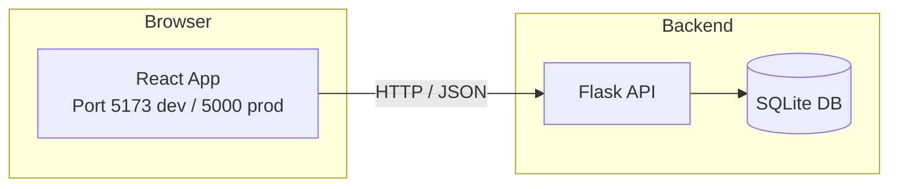

<div align="center">

# 📝 TODO application

### A full-stack ToDo app — Flask API on the back, React on the front.

[](https://github.com/yuktheshwarbhat/to-do-app/actions/workflows/test.yml)
[](https://www.python.org/)
[](https://react.dev/)
[](https://vite.dev/)
[](#)
[](LICENSE)

</div>

---

## ✨ Features

- 🔐 **User Authentication** — register, login, logout with hashed passwords
- 👥 **Multi-user** — every user sees only their own todos
- ➕ **Full CRUD** — add, edit, toggle, and delete todos
- 🎯 **Priorities** — mark tasks as `low`, `medium`, or `high`
- 🔍 **Smart Filters** — view all, active, or completed tasks
- 🧹 **Clear Completed** — one-click cleanup of finished tasks
- 🌙 **Dark Mode** — eye-friendly theme that remembers your choice
- ⚛️ **React Frontend** — fast, modern single-page UI
- 🚀 **Production Ready** — Flask serves the built React app on a single port

---

## 🛠️ Tech Stack

| Layer | Technology |
|---|---|
| **Backend** | Python · Flask · SQLite |
| **Frontend** | React · Vite · JavaScript |
| **Testing** | pytest · Vitest · React Testing Library · Playwright |
| **CI/CD** | GitHub Actions |

---

## 🏗️ Architecture


<br>

## 📁 Project Structure
```
to-do-app/
├── app.py                     # Flask application + API routes
├── requirements.txt           # Python dependencies
├── pytest.ini                 # Pytest configuration
│
├── templates/                 # Legacy Flask templates
├── tests/                     # Backend pytest tests
├── tests_e2e/                 # Playwright E2E tests
│
├── frontend/                  # React application
│   ├── src/
│   │   ├── App.jsx            # Main React component
│   │   ├── App.test.jsx       # React component tests
│   │   └── setupTests.js      # Test setup
│   ├── vite.config.js         # Vite + Vitest config
│   └── package.json
│
└── .github/workflows/         # CI pipeline
    └── test.yml               # Runs pytest + vitest
```